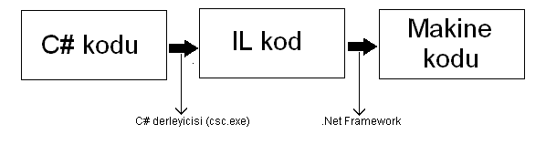
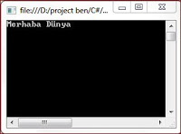
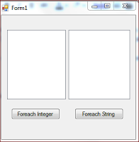
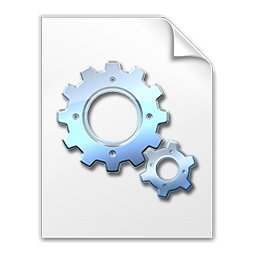
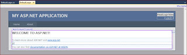
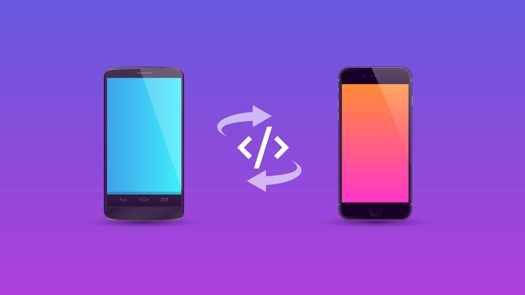

# **CSharp** Nedir

- **C#** Microsoft tarafından geliştirilmiş olan bir programlama dilidir.
- **C++** ve **Java** dillerine oldukça benzer, ancak **C#**'ın bu dillere benzerliği yanında farkları da vardır. 
> Örneğin **C#**, **C++**'dan farklı olarak %100 nesne yönelim tekniğine sahiptir. 
> **Java**'dan farklı olarak ise **C#**'ta gösterici (pointer) kullanılabilir. 
> Böylelikle eski yazılım bileşenleriyle uyumlu bir şekilde çalışılabilir.

# .NET Framework
- **C#** kodları, **C++** veya **Visual Basic**'ten farklı olarak direkt makine koduna derlenmez. Önce **IL** dediğimiz bir ara koda derlenir. Bu derlenen ilk kodun dosyasına assembly denir ve uzantısı exe'dir. 
- Bu dosya çalıştırılmak istendiğinde ise **.Net Framework** devreye girer ve **IL** kodu makine koduna dönüştürür, böylelikle artık kodu bilgisayar anlayabilir. İşte bu yüzden de yazdığımız programın bir bilgisayarda çalışması için o bilgisayarda **.Net Framework** programının kurulu olması gerekir, çünkü **.Net Framework** **IL** kodu bilgisayarın anlayabileceği koda çevirir. 
- **.Net Framework**, oluşturduğu makine kodlarını geçici bir süreliğine belleğe koyar, eğer aynı kodlar tekrar çalıştırılmak istenirse tekrar **IL** koddan makine koduna dönüşüm yapmak yerine bu belleğe kaydettiği makine kodlarını kullanır. Bu yüzden oluşturduğumuz programımızı ilk çalıştırdığımız zaman programımız biraz yavaş çalışabilir, ancak daha sonraki çalışmalarda oldukça hızlanacaktır.

- **C#**'ta kodun direkt makine kodu yerine, önce **IL** koda çevrilmesinin bazı avantajları vardır. Bunlardan en önemlisi programımızın farklı işletim sistemlerinde çalışmasının eskiye oranla çok daha kolay olmasıdır. Çünkü makine kodu taşınabilir değildir, programları direkt makine koduna derlediğimiz zaman ilgili programın belirli bir işletim sistemine göre derlenmesi gerekir. Halbuki **IL** kod taşınabilirdir, ortak bir koddur, işletim sistemlerindeki çeşitli programlar vasıtasıyla makine koduna dönüştürülebilir. Örneğin Windows'ta bu işi **.Net Framework** yaparken, Linux'ta Mono yapabilir.

# **C#** ile Neler Yapılabilir

- ### Konsol Uygulamaları (Console Applications)
	

	Grafiksel kullanıcı arayüzünden çok, komut satırı penceresinde programcı tarafından yazılan uygulama çalışmalarına verilen isimdir. Konsol uygulamaları **MS-DOS** olarak ifade edilen nesne yönelimli programlamanın yaygınlaşmadığı dönemlerde kullanılan bir arayüz olmuştur. Bu uygulama modelini kullanıcının etkileşim kurması gerekmeyen uygulamalarda basit bir arayüz oluşturmak için kullanılabilir.

- ### Windows Form Uygulamaları
	

	**Grafiksel kullanıcı arayüzü (GUI – Graphical User Interface)** olarak tanımlanır. Windows form uygulamalarını, konsol uygulamalarından ayıran en önemli özelliği de budur. **Windows Form** uygulaması oluşturmak için **Toolbox** adı verilen araç kutusundan nesnel araçlar sürükle bırak yöntemi ile kolayca oluşturulabilir.
	**Windows Form** uygulamaları, bilgisayar programları geliştirmek amacıyla kullanılmaktadır. **Windows Forms** Application seçeneği ile yeni bir windows uygulama penceresi açılarak program geliştirmeye başlanabilir. Ayrıca **Windows Form** uygulaması içinde grafiksel olarak daha gelişmiş çalışmalar yapmak da mümkün hale getirilmiştir. Daha güçlü grafiksel arayüzler için **WPF** ile uygulama geliştirmek gerekmektedir.
	Windows form uygulamaları için veritabanı bağlantısı kurabilmek için kullanılan .Net kütüphanesinin adı **Ado.Net** olarak tanımlanmıştır. Bu konu üzerinde çalışmak isteyenlerin internet üzerinde **Ado.Net** olarak arama yapmaları gerekmektedir.

- ### DLL
	#### DLL Nedir? 
	

	**DLL**: Dinamic Link Library ifadesinin kısaltılmasıdır. Yani dinamik kütüphaneler oluşturmak için kullandığımız yapıdır. Örnek verecek olursam **C#**’ta bir yapıyı sürekli kullanıyorsunuz böyle bir durumda hem kod sayfasında bir karmaşa olacak hem de sürekli aynı kodları yazmak zorunda kalacaksınız. İşte bu iki sorunu ortadan kaldırmak için **DLL** yazarsınız. **DLL** yazdıktan sonra uygulama sayfasında sürekli aynı kodları yazmak yerine yazılan **DLL**’i çağırarak ilgili kodları çalıştırırız.

- ### ASP.NET uygulaması geliştirme
	

	Web form uygulamaları ise **Ado.Net** yerine **ASP.Net** sayfa yapısı ile çalışmaktadır. Web form uygulamaları temel olarak **Windows Form** Uygulaması gibi düşünülebilir. Fakat aralarında temel faklılıklar vardır. Web Form uygulamaları internet üzerinden erişilebilen form uygulamalarıdır. Bundan dolayı uygulamalar kişisel bilgisayar yerine web tarayıcısı ile çalışmaktadır.

- ### Web Servisleri
	

	Kısaca veri iletimi için kullanılan sistemlerdir diyebiliriz. Biraz daha açacak olursam Evrensel veri transer metodu sayılan **XML** ve **HTTP** kuralları ile internet ağı ile dünyanın her hangi bir yerine veri taşıyan sistemlerdir.  Web servisi işlemlerinde veriler bir başka kullanıcıya gönderildiği için güvenlik ve adresleme gibi konular oldukca önemlidir. Microsoft, **C#**’ta web servisleri kullanımını güvenli kılan pek çok işlemler yapmaktadır.

- ### Mobil Programlama
	

	Genel olarak **Windows Phone** işletim sistemleri için uygulama geliştirilir. Son zamanlarda meşhur olan **Xamarin** ile **iOS** ve **Android** içinde uygulama geliştirebilirsiniz.